# Walkthrough - Private LLM Stack Deployment

I have successfully deployed a private, production-grade LLM stack on the `isaac-sim-01` VM.

## Deployment Summary
- **Model**: `deepseek-ai/DeepSeek-R1-Distill-Llama-8B` (Reasoning optimized, ~15GB VRAM usage)
- **Engine**: vLLM (OpenAI-compatible)
- **Interface**: Open WebUI
- **Hardware**: NVIDIA L4 (24GB VRAM)
- **Infrastructure**: Docker Compose on Private Bridge Network

> [!IMPORTANT]
> **Access Details**
> - **Open WebUI URL**: [http://35.238.78.4:3000](http://35.238.78.4:3000)
> - **Authentication**: First user to register becomes Admin.
> - **API Endpoint**: `http://35.238.78.4:8000/v1`
> - **Master API Key**: `sk-0a27aa684617dccd803b8d51adb69ee2`

> [!NOTE]
> **Public Access (Cloudflare Tunnel)**
> - **Public URL**: [https://cope-manga-preparing-frederick.trycloudflare.com](https://cope-manga-preparing-frederick.trycloudflare.com)
> - **HTTPS**: ✅ Automatic (via Cloudflare)
> - **Cost**: $0 (Free)
> - **Note**: This is a temporary URL. To make it permanent, you would need a paid Cloudflare account or a custom domain.

## System Architecture

```mermaid
graph TD
    subgraph "GCP VM (isaac-sim-01)"
        subgraph "Docker Compose Group"
            direction TB
            
            subgraph "Container 1: vLLM Service"
                vLLM["🧠 vLLM Engine"]
                Model[("📦 DeepSeek R1 8B\n(15GB VRAM on L4)")]
                vLLM --> Model
            end
            
            subgraph "Container 2: Open WebUI"
                WebUI["💻 Open WebUI\n(User Interface)"]
                DB[("🗄️ webui.db\n(SQLite User Data)")]
                WebUI --> DB
            end

            WebUI --"Private Network (llm-net)"--> vLLM
        end
        
        Volume1[("💾 Docker Volume\nopen-webui-data\n(Persists User DB)")]
        DB -.-> Volume1
    end

    User(("👤 User")) --"SSH Tunnel (Port 3000)"--> WebUI
```



### Components
1.  **vLLM Service**: The "Brain". It loads the model into the GPU and processes text.
2.  **Open WebUI**: The "Face". It stores your accounts/chats and provides the website.
3.  **Data Persistence**: The WebUI database (`webui.db`) is stored in a **Docker Volume** (`open-webui-data`). It is **not** a file in your project folder, which is why you don't see it. This keeps it safe even if you delete the container.

## Implementation Details

### 1. Storage Expansion
We encountered a disk space issue during the initial pull.
- **Action**: Resized VM boot disk from 150GB to **500GB**.
- **Result**: Sufficient space for model weights and future datasets.

### 2. Service Configuration
Files created in `~/deepseek-app`:
- [docker-compose.yml](file:///Users/folin/projects/deepseek-app/docker-compose.yml): Orchestrates vLLM and Open WebUI with NVIDIA runtime.
- [setup.sh](file:///Users/folin/projects/deepseek-app/setup.sh): Handles environment setup and launch.
- [.env](file:///Users/folin/projects/deepseek-app/.env): Stores the secure API key.

### 3. Verification
Automated validation confirmed the stack is healthy.
```bash
# curl -X POST http://localhost:8000/v1/chat/completions ...
{
  "model": "deepseek-ai/DeepSeek-R1-Distill-Llama-8B",
  "choices": [
    {
      "message": {
        "role": "assistant",
        "content": "Okay, so I need to figure out what implies a successful deployment..."
      }
    }
  ]
}
```

## Setup & Maintenance
To restart the stack (e.g., after reboot):
```bash
cd ~/deepseek-app
docker compose up -d
```
